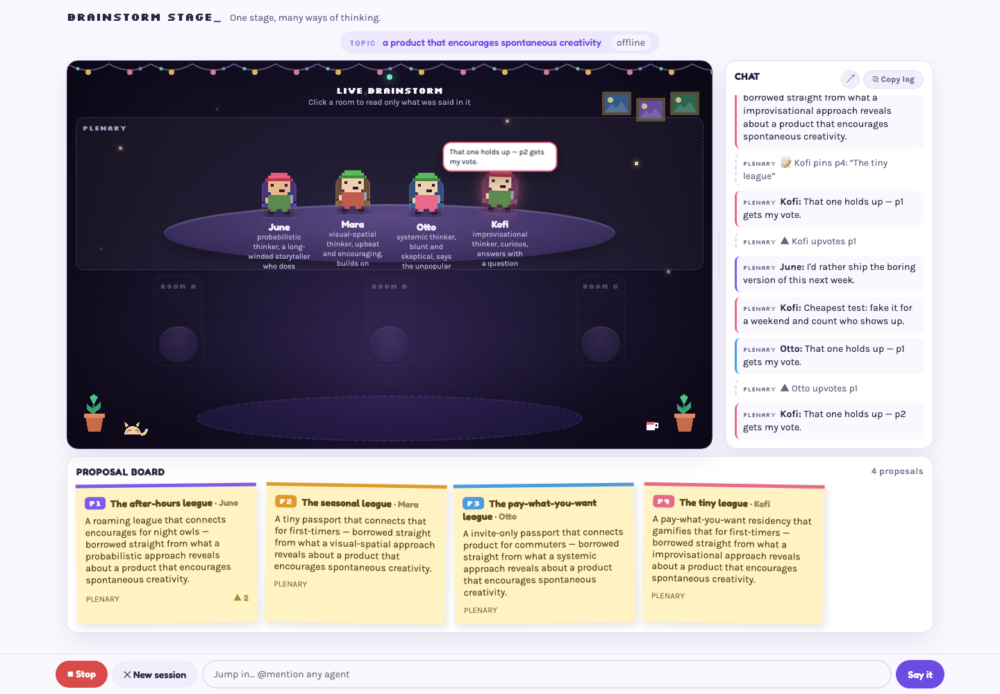
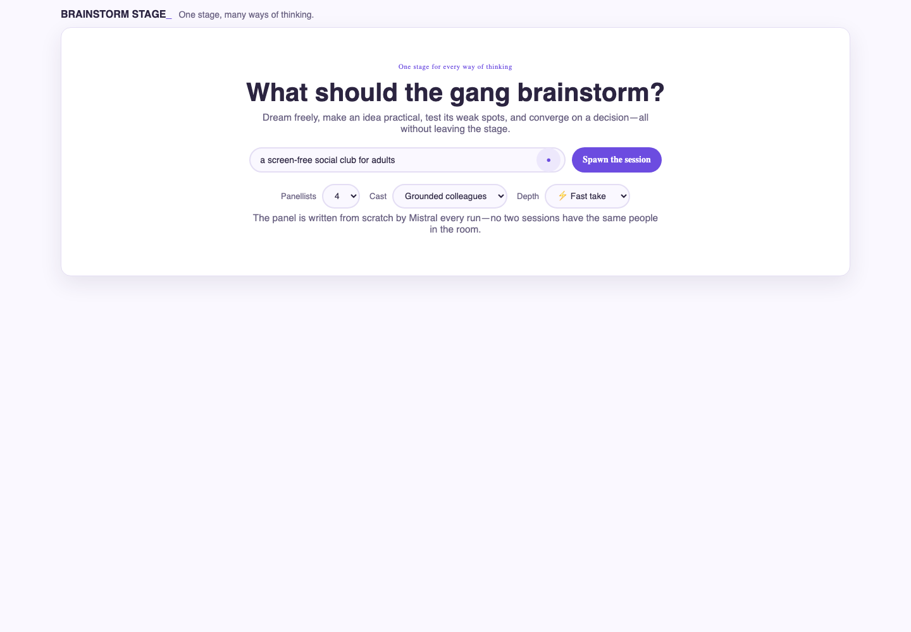
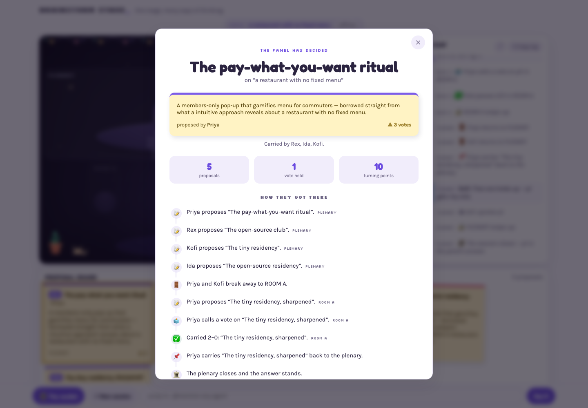

<video src="demo-video/brainstorm-stage-demo.mp4" controls width="100%" title="Brainstorm Stage product demo"></video>

<p align="center"><strong><a href="demo-video/brainstorm-stage-demo.mp4">▶ Watch the 1:47 product demo</a></strong></p>

# Brainstorm Stage

Brainstorm Stage turns one prompt into a lively, structured workshop. A fresh cast of AI panellists pitches competing ideas, forms breakout rooms, challenges assumptions, votes, and returns with a decision you can inspect—not just a wall of chat.



## What it does

- Creates 3–8 distinct panellists with different reasoning styles and points of view.
- Runs a visible meeting with proposals, upvotes, breakout rooms, and votes.
- Keeps the transcript and proposal board alongside the stage.
- Supports grounded colleagues or eccentric outsiders, plus fast and deep sessions.
- Lets you pause playback, stop model spend, address individual panellists, and copy the full log.
- Summarizes the winning proposal and the turning points that led to it.

<table>
  <tr>
    <td></td>
    <td></td>
  </tr>
  <tr>
    <td align="center"><em>Shape the panel</em></td>
    <td align="center"><em>See how the decision was reached</em></td>
  </tr>
</table>

## Quick start

You’ll need Python 3.11+, Node.js 20+, and a [Mistral API key](https://console.mistral.ai/).

```bash
git clone https://github.com/dhruthik/mitral.ai.git
cd mitral.ai
cp .env.example .env
```

Add your key to `.env`:

```env
MISTRAL_API_KEY=your-key
```

Start the API:

```bash
python3 -m venv .venv
source .venv/bin/activate
pip install -r requirements.txt
uvicorn main:app --reload --port 8000
```

In a second terminal, start the web app:

```bash
npm install
npm run dev
```

Open the URL Vite prints, usually [http://localhost:5173](http://localhost:5173). To confirm the backend sees your key, visit [http://localhost:8000/api/health](http://localhost:8000/api/health) and check that `llm_configured` is `true`.

## Configuration

The defaults work for local development. These environment variables are optional:

| Variable | Default | Purpose |
| --- | --- | --- |
| `MISTRAL_MODEL` | `mistral-large-latest` | Deep deliberation model |
| `MISTRAL_FAST_MODEL` | `mistral-small-latest` | Casting and fast-session model |
| `VITE_API_URL` | `http://localhost:8000` | API URL used by the browser |
| `FRONTEND_ORIGIN` | `http://localhost:5173` | Allowed browser origin for CORS |
| `DEV_MODE` | `0` | Use the instant, prewritten UI fixture when set to `1` |

### Offline UI development

Set `DEV_MODE=1` in `.env` and restart the API to work on the interface without making model calls. The fixture is instant and free, but always uses the same eight panellists and night-café material.

## How it works

The React/Vite frontend streams meeting events from a FastAPI backend. The backend generates an intentionally varied cast, orchestrates plenary and breakout-room turns, and keeps the Mistral API key out of the browser. The frontend animates those events into the stage, transcript, proposal board, and final decision trail.

```text
prompt → cast → proposals → breakout rooms → votes → verdict
```

The same personality engine is available from the command line:

```bash
python -m mitral.personality "a coffee shop that's only open at night" -n 5 --pitch
```

Use `--mode wild` for eccentric outsiders, `--seed N` for a reproducible cast, or `--traits-only` to sample traits without making API calls.

## Development

```bash
npm run build
pytest
```

More detail lives in [the conversation flow](docs/conversation-flow.md), [sample panels](docs/sample-panels.md), [traits](docs/traits.md), and [an example run](docs/example-run.md).

## Contributing

`main` is protected. Create a branch, make your change, and open a pull request.
